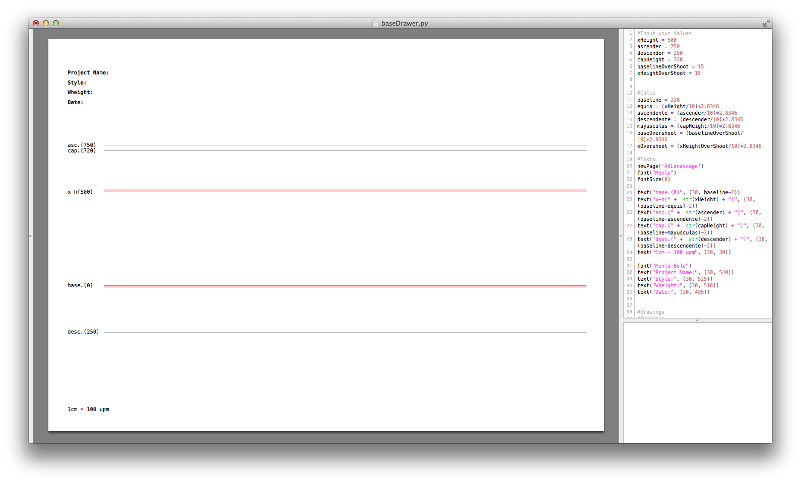

Glyphs-Scripts
==============

## baseDrawer.py

The script draws an A4 page with metric guidelines ready for printing and use it for sketching letters.
###How to use:
Input your values on UPM and run the script.
###Note:
The scale is 1 cm ≈ 100 upm for simple calculations between drawing and font apps. 

